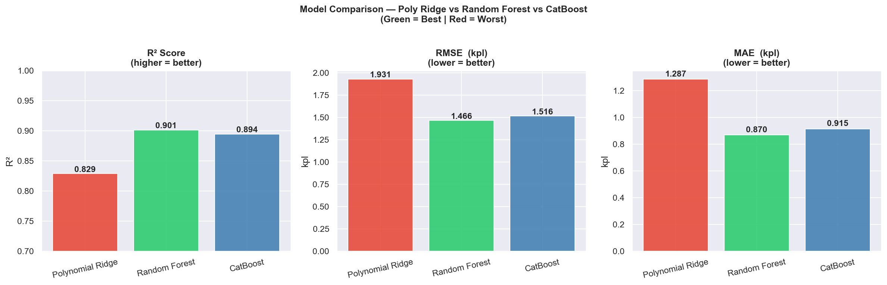
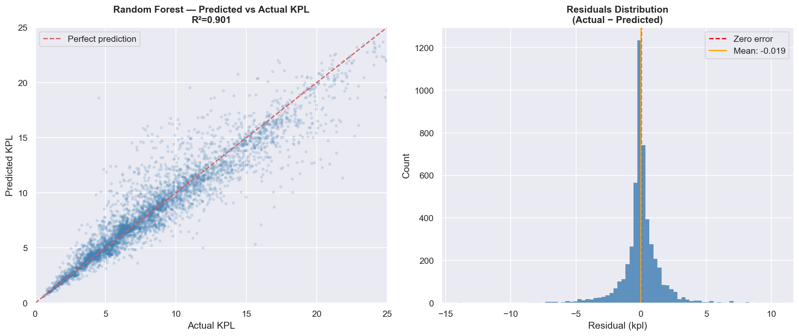
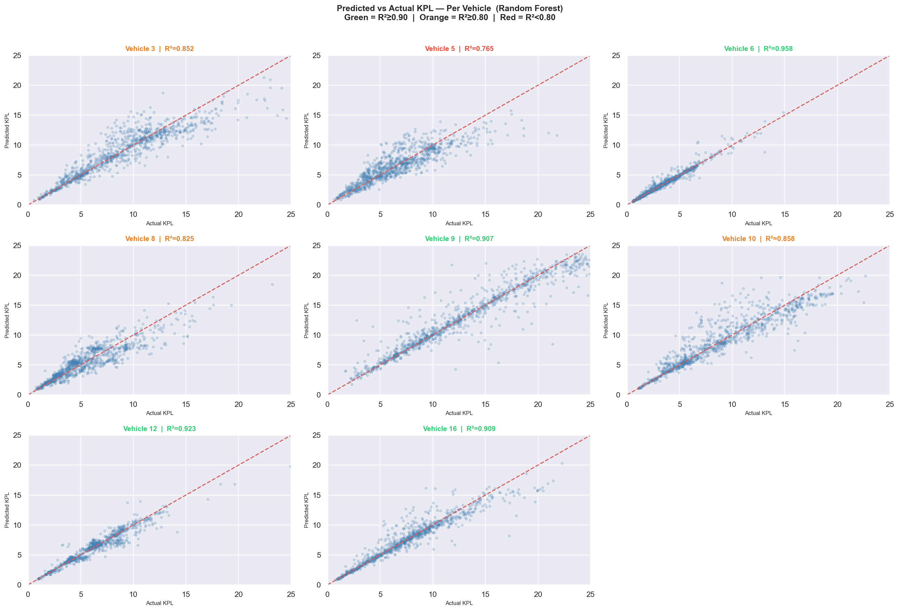
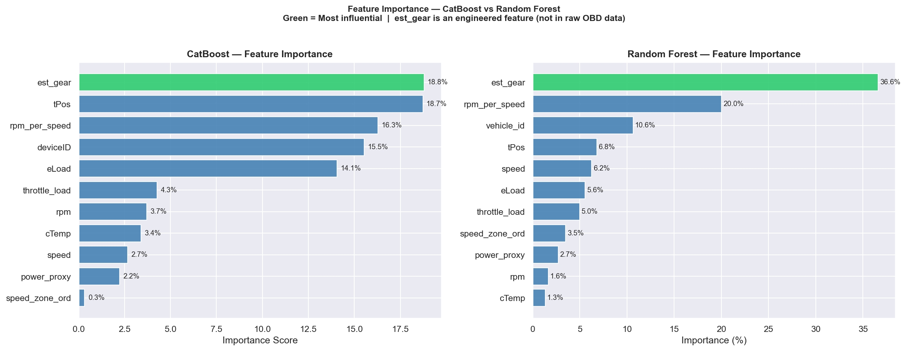

# 🚗 Vehicle Telematics — Fuel Efficiency & Driver Behavior Analysis

Real-world OBD sensor data from a 16-vehicle fleet analyzed to identify optimal driving conditions, estimate gear usage, calculate trip-level fuel consumption, and predict fuel efficiency using machine learning.

---

## 📊 Project Summary

| | |
|---|---|
| **Dataset** | LEVIN Vehicle Telematics (Yun Solutions) |
| **Vehicles** | 16 |
| **Trips** | 431 |
| **Records** | ~3.1M rows |
| **Period** | Nov 2017 – Jan 2018 |
| **Tools** | Python, Pandas, NumPy, Scikit-learn, CatBoost, Matplotlib, Seaborn |

---

## 🔍 What Was Analyzed

### 1. Sensor Distributions
Cleaned and validated 6 OBD sensors: speed, RPM, engine load, fuel efficiency (kpl), coolant temperature, and throttle position. Identified and removed GPS speed outliers (up to 512 km/h), KPL spikes, and corrupted header rows embedded in the raw CSV.


### 2. Temporal Patterns
- Median speed drops significantly during rush hours (07:00–09:00 and 17:00–20:00)
- Trip distribution is relatively even across weekdays with a slight dip on Sundays


### 3. Gear Estimation (per vehicle)
Since no gear sensor exists in OBD data, gear was estimated using:

```
gear_ratio = RPM / speed
```

Higher ratio = lower gear (high RPM, low speed). KMeans clustering was applied **per vehicle** so each vehicle is calibrated to its own RPM and speed range — no universal thresholds assumed.


### 4. Speed-Efficiency Map (per vehicle)
Grouped all readings into 12 speed zones (0–10, 10–20, … 120+ km/h) and calculated average fuel efficiency per zone per vehicle.

**Key finding:** Fleet-wide optimal speed zone is **60–90 km/h** — vehicles operating in this range show up to 40% higher fuel efficiency compared to low-speed urban driving below 30 km/h.


### 5. Fleet Fuel Consumption Summary
Calculated total distance, total fuel consumed, and overall km/L per vehicle using time-series integration (speed × time delta).


| | Vehicle |
|---|---|
| Most efficient | Vehicle 9 → 12.4 kpl |
| Least efficient | Vehicle 6 → 3.4 kpl |
| Efficiency gap | ~9 kpl between best and worst |

---

## 🤖 Fuel Efficiency Prediction Model

A CatBoost regression model trained to predict fuel efficiency (kpl) from OBD sensor readings.

**Why CatBoost over Random Forest:** Feature importance is more evenly distributed across sensors, `deviceID` is handled as a native categorical without one-hot expansion, and importance ranking aligns with ECU injection logic — gear → throttle → RPM/speed ratio → engine load.

### Feature Engineering

| Feature | Type | Description |
|---|---|---|
| `est_gear` | **Engineered** | KMeans gear estimation (1–6) per vehicle — not in raw OBD data |
| `rpm_per_speed` | **Engineered** | RPM / (speed+1) — continuous gear ratio signal |
| `throttle_load` | **Engineered** | tPos × eLoad / 100 — driving aggressiveness proxy |
| `tPos` | Raw OBD | Throttle position — primary injection trigger |
| `eLoad` | Raw OBD | Engine load — ECU computed injection output |
| `speed` | Raw OBD | Vehicle speed (km/h) |
| `cTemp` | Raw OBD | Coolant temperature — cold-start effects |
| `deviceID` | Identifier | Per-vehicle ECU calibration differences |

### Model Comparison

| Model | R² | RMSE | MAE |
|---|---|---|---|
| Polynomial Ridge | 0.829 | 1.932 kpl | 1.287 kpl |
| Random Forest | 0.901 | 1.466 kpl | 0.870 kpl |
| **CatBoost** | **0.893** | **1.527 kpl** | **0.926 kpl** |



### Predicted vs Actual



### Per-Vehicle Predictions



### Feature Importance

> `est_gear` (engineered from RPM/speed via KMeans) and `tPos` together account for ~38% of predictive power — consistent with ECU injection logic where gear selection and throttle demand are the primary determinants of fuel injection quantity.



---

## ⚠️ Data Quality Notes

| Vehicle | Issue |
|---|---|
| 0, 1, 2, 4, 11 | KPL sensor not recording — excluded from fuel analyses |
| Vehicle 7 | KPL sensor intermittent — excluded from fuel analyses |
| Vehicle 9 | Consistently higher KPL values — likely different engine type or displacement |

---

## 📁 Repository Structure

```
vehicle-telematics/
├── notebook/
│   ├── 01_data_cleaning.ipynb     ← load, clean, export clean.parquet
│   ├── 02_eda.ipynb               ← sensor distributions, temporal patterns
│   ├── 03_gear_estimation.ipynb   ← KMeans gear estimation per vehicle
│   ├── 04_speed_efficiency.ipynb  ← speed zones, fleet fuel summary
│   └── 05_fuel_model.ipynb        ← CatBoost model, predictions, importance
├── src/
│   └── features.py                ← shared utility functions (cleaning, gear estimation, feature engineering)
├── outputs/                       ← all generated charts
├── data/
│   └── processed/
│       ├── trip_summary.csv
│       ├── fleet_summary.csv
│       ├── speed_map.csv
│       └── gear_analysis.csv
├── .gitignore
└── README.md
```

**Notebook execution order:** `01 → 02 → 03 → 04 → 05`
Each notebook reads from the processed output of the previous one via `data/processed/`.

---

## 🗄️ Dataset

This project uses the **LEVIN Vehicle Telematics** dataset published by Yun Solutions.

- **Source:** [Kaggle — LEVIN OBD Sensor Data](https://www.kaggle.com/datasets/yunlevin/levin-vehicle-telematics)
- **File:** `v2.csv` (692 MB — not included in this repo due to GitHub file size limits)

**To run locally:**
1. Download `v2.csv` from Kaggle and place it in `data/` as `allcars.csv`
2. Install dependencies: `pip install -r requirements.txt`
3. Run notebooks in order: `01 → 02 → 03 → 04 → 05`

---

## 🛠️ Tech Stack

**Python 3.13** — Pandas, NumPy, Scikit-learn, CatBoost, Matplotlib, Seaborn, PyArrow, Jupyter

---

## 👤 Author

**Paşan Sancak** — Data Analyst | Ex-Bosch Automotive

- [LinkedIn](https://linkedin.com/in/pasansancak)
- [GitHub](https://github.com/pasansancak)
- [Upwork](https://www.upwork.com/freelancers/~019d81f8710bda98b5)
